# Introduction
  
Dans le cadre du module "*R et Data Visualization*" (**DSIA-4101C**), nous avons eu l'opportunité de réutiliser les notions de R vues dans le cours pour produire un rapport d'étude sur un sujet de notre choix, en répondant à une problématique. Le travail est réalisé en binôme et l'objectif est de produire un dashboard R Shiny d'un jeu de données accessibles publiquement et non modifiées.  

Notre responsable est Monsieur **COURIVAUD Daniel**, et notre binôme est composé de Mademoiselle **Andrianihary RAZAFINDRAMISA** et de Mademoiselle **Xianli LI**.
  
Nous avons choisi de travailler sur les jeux de données :
- *[Insertion professionnelle des diplômé.e.s de Diplôme universitaire de technologie (DUT) en universités et établissements assimilés - données nationales par disciplines détaillées](https://www.data.gouv.fr/fr/datasets/insertion-professionnelle-des-diplome-e-s-de-diplome-universitaire-de-technologie-dut-en-universites-et-etablissements-assimiles-donnees-nationales-par-disciplines-detaillees/#_)*
  > *source: data.gouv.fr*
- *[Insertion professionnelle des diplômé.e.s de Licence professionnelle en universités et établissements assimilés](https://www.data.gouv.fr/fr/datasets/insertion-professionnelle-des-diplome-e-s-de-licence-professionnelle-en-universites-et-etablissements-assimiles/#_)*
  > *source: data.gouv.fr*
- *[Insertion professionnelle des diplômés de Master en universités et établissements assimilés](https://www.data.gouv.fr/fr/datasets/insertion-professionnelle-des-diplomes-de-master-en-universites-et-etablissements-assimil-0/#_)*
  > *source: data.gouv.fr*

#### Problématique
Nous avons choisi de répondre à la problématique : <ins>*Le choix des diplômes et le nombre d'années d'étude sont-ils primordiaux pour l'insertion professionnelle ?*</ins>

<br>

___

# Table des matières

[[_TOC_]]
___


# I. Guide de l'utilisateur

## 1. Installation et Téléchargement

### A. Environnement de travail
Dans un premier temps, afin d'exploiter notre projet, il faudra télécharger et installer le langage de base ***R version 3.5.X*** sur votre appareil. Pour cela, que votre appareil soit sous Linux, macOS, Windows ou autre, vous pouvez accéder à la page de téléchargement de R en cliquant [ici](https://cran.r-project.org/bin/). Nous recommandons fortement ***R Studio Desktop***, un puissant IDE open source pour R, comme environnement de développement. Choisissez la licence Open Source gratuite qui se trouve [ici](https://rstudio.com/products/rstudio/download/). 

Après l'installation, vérifiez le fonctionnement sur votre appareil en créant un répertoire de travail et en installant des packages à partir des lignes de commande R suivantes :

```bash
> install.packages("tidyverse")
```

```bash
> install.packages("devtools")
```

Des warnings peuvent apparaître dans les messages du log, mais ils ne vont pas bloquer l'exécution généralement. Si la dernière version de R est installée, l'installation du package donnera un message de réussite :

```bash
package ‘tidyverse’ successfully unpacked and MD5 sums checked
```

et l'importation des packages est possible :

```bash
> library(ggplot2)
```

Sinon, vérifiez la version de R avec la commande suivante :

```bash
> version
```

et, s'il le faut, mettez R à jour avec les commandes suivantes :

```bash
> install.packages("installr")
> library(installr)
> updateR()
```

### B. Le dashboard

#### Télécharger le projet

Le projet se trouve sur un dépôt Git se situant sur [cette page](https://git.esiee.fr/lix/projet-r). Ce dépôt pourra être "*cloné*" dans un répertoire de travail que vous avez créé sur votre ordinateur.

#### Packages nécessaires

Des packages supplémentaires sont nécessaires au bon fonctionnement de notre projet.

```bash
library(shiny)
```

Shiny permet de créer facilement des applications Web interactives avec R. 

```bash
library(dplyr)
```

Dplyr est conçu pour importer et manipuler des données dans R.

```bash
library(ggplot2)
```

Ggplot2 est un système de création graphique déclarative.

```bash
library(shinydashboard)
```

Shinydashboard permet de créer des tableaux de bord avec "Shiny".

```bash
library(leaflet)
```

Leaflet permet de créer, de personnaliser et d'utiliser des cartes interactives à l'aide de la bibliothèque interactive JavaScript 'Leaflet' et du package 'htmlwidgets'.

```bash
library(sp)
```

Sp fournit des fonctions pour le traçage des données sous forme de cartes, et pour la récupération des coordonnées.

On peut utiliser la commande vue précedemment pour les télécharger et les installer :

```bash
> install.packages("package")
```

où "package" est le nom du package à installer.

## 2. Exécution

Commencez par ouvrir le projet se trouvant dans le répertoire de travail en suivant File > Open Project..., quel que soit le système d'exploitation, puis utilisez la commande suivante afin de lancer l'application :

```bash
> runApp('Dashboard')
```

Vous pouvez également exécuter l'application en cliquant sur le bouton 'Run App'.

## 3. Utilisation

Une fois éxécuté, le "*dashboard*" est accessible à une adresse donnée comme suit :

```bash
Listening on http://127.0.0.1:7216
```

### A. Menu

Un menu permet d'accéder aux différentes pages de notre application :

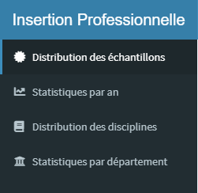

Il y a quatre pages :
- *Distribution des échantillons*,
- *Statistiques par an*,
- *Distribution des disciplines*,
- et *Statistiques par département*.
Ces pages sont accessibles en cliquant sur leur label, dans le menu à gauche.

### B. *Distribution des échantillons*

Une fois l'installation et l'exécution réussies, l'application s'ouvre sur la page suivante:  

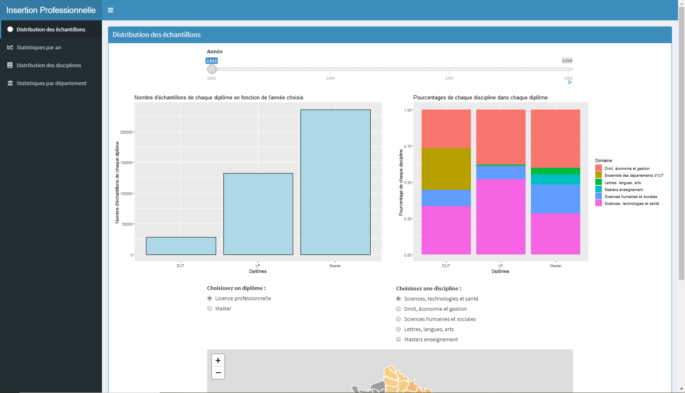

- #### Première partie

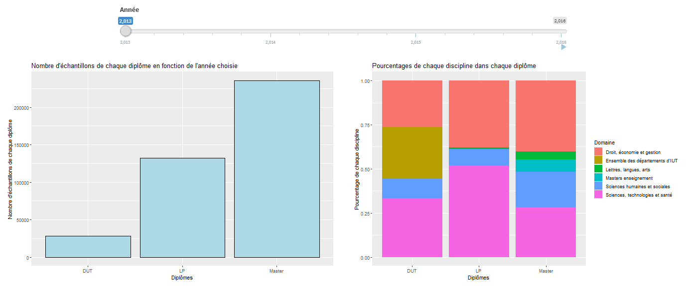

La partie supérieure de la page affiche un histogramme du nombre d'échantillons de chaque diplôme, et un diagramme à bandes du pourcentage de chaque discipline, dans chaque diplôme, en fonction de l'année que l'on choisit avec le "*slider*" situé au-dessus des graphes. En plus de définir une année, le slider permet également de les faire défiler. Cela permet de voir la progression et la distribution du nombre d'échantillons et du pourcentage de chaque discipline au cours des années. 

- #### Seconde partie

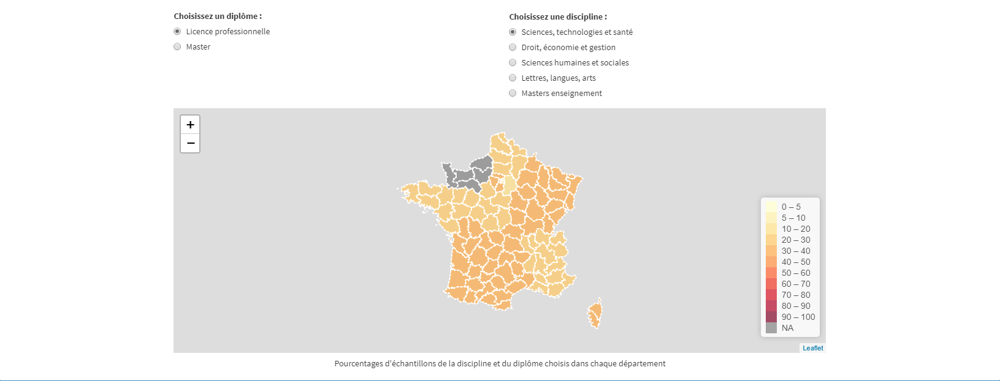

La partie inférieure de la page affiche une carte des départements de la France métropolitaine. On peut intéragir avec cette dernière grâce à des "*radio buttons*", situés au-dessus de la carte. Ils permettent de choisir une discipline et un diplôme afin d'afficher sur la carte les pourcentages d'échantillons de la discipline et du diplôme choisis avec le nom de chaque département. Cela permet d'avoir plus d'informations sur un département spécifique grâce à une représentation géolocalisée des échantillons. De plus, cela permet de comparer un département, une région ou une académie par rapport à d'autres.

### C. *Statistiques par an*

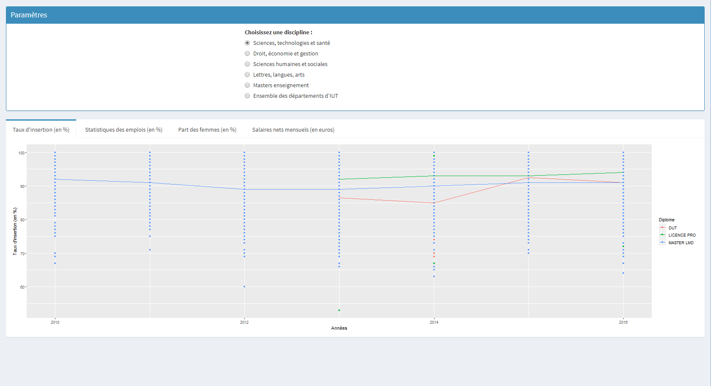

- #### Paramètres

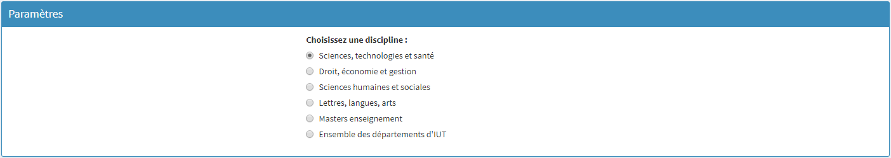

Ce bloc permet de contrôler les différents graphes présents dans le bloc inférieur, en modifiant la *discipline*.

- #### Evolution du taux d'insertion au cours du temps

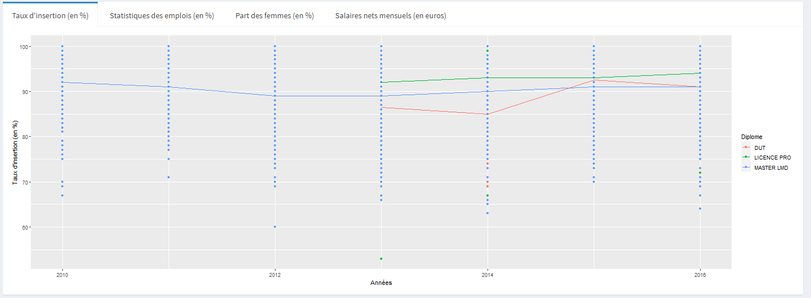

Ce graphe montre l'évolution de la tendance et de la distribution du taux d'insertion (en %) de chaque diplôme au cours des années en fonction de la discipline choisie. L'abscisse représente les années et l'ordonnée le taux d'insertion (en %).

- #### Evolution des statistiques des emplois au cours du temps 

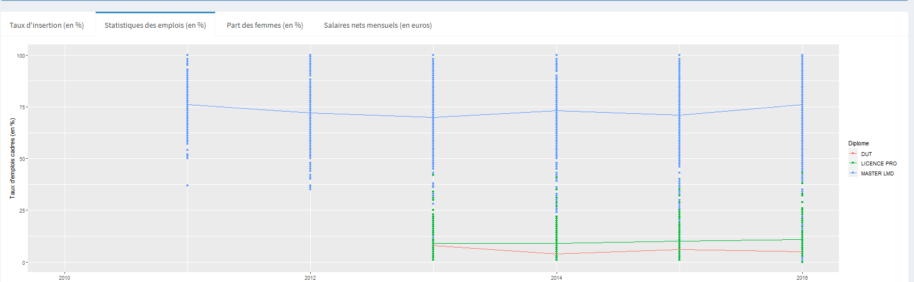

Ce graphe montre l'évolution de la tendance et de la distribution du taux d'emplois cadres (en %) de chaque diplôme au cours des années en fonction de la discipline choisie. L'abscisse représente les années et l'ordonnée le taux d'emplois cadres (en %).

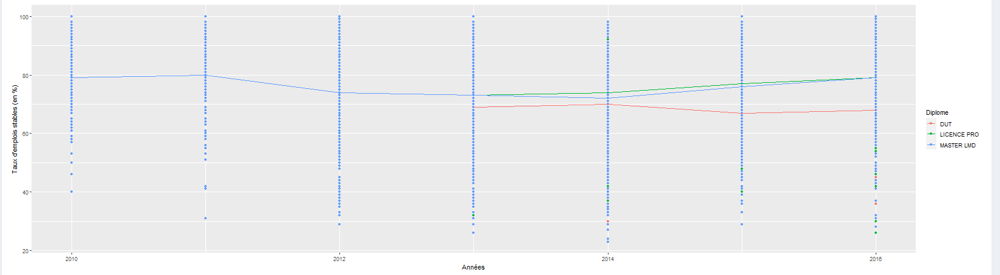

Ce graphe montre l'évolution de la tendance et de la distribution du taux d'emplois stables (en %) de chaque diplôme au cours des années en fonction de la discipline choisie. L'abscisse représente les années et l'ordonnée le taux d'emplois stables (en %).

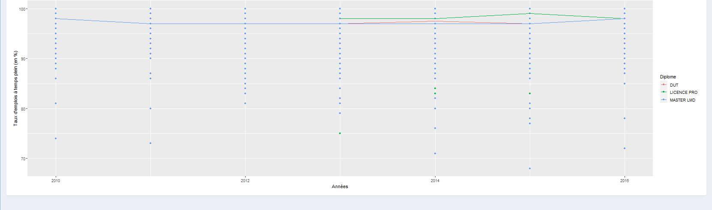

Ce graphe montre l'évolution de la tendance et de la distribution du taux d'emplois à temps plein (en %) de chaque diplôme au cours des années en fonction de la discipline choisie. L'abscisse représente les années et l'ordonnée le taux d'emplois à temps plein (en %).

- #### Evolution de la part des femmes au cours du temps

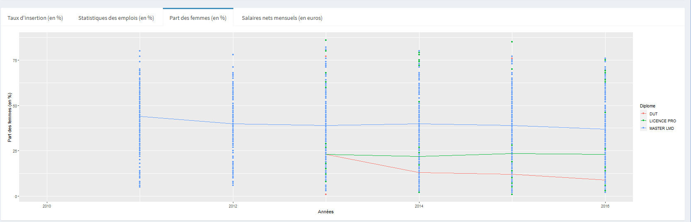

Ce graphe montre l'évolution de la tendance et de la distribution de la part des femmes (en %) de chaque diplôme au cours des années en fonction de la discipline choisie. L'abscisse représente les années et l'ordonnée la part des femmes (en %).

- #### Evolution des salaires nets mensuels au cours du temps

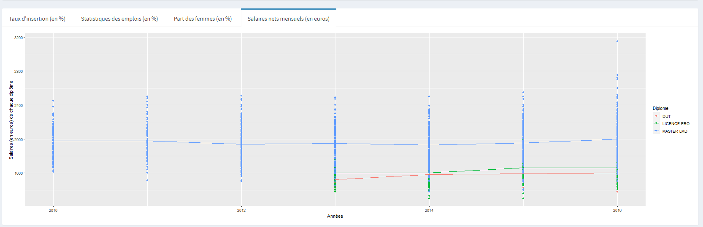

Ce graphe montre l'évolution de la tendance et de la distribution des salaires nets mensuels (en euros) de chaque diplôme au cours des années en fonction de la discipline choisie. L'abscisse représente les années et l'ordonnée les salaires nets mensuels (en euros).

### D. *Distribution des disciplines*

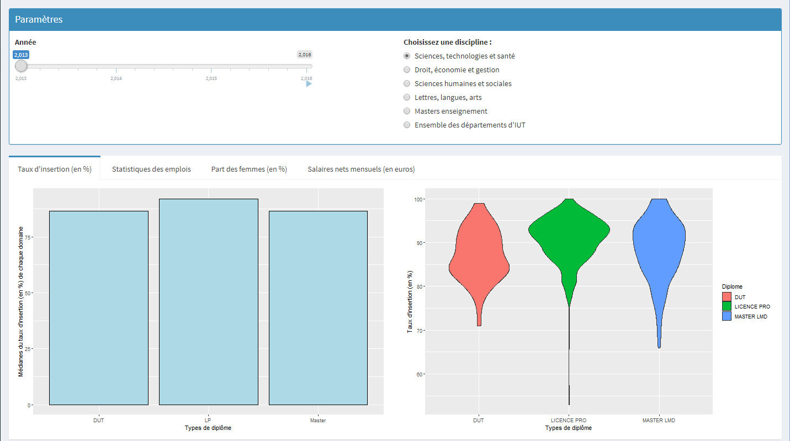

- #### Paramètres

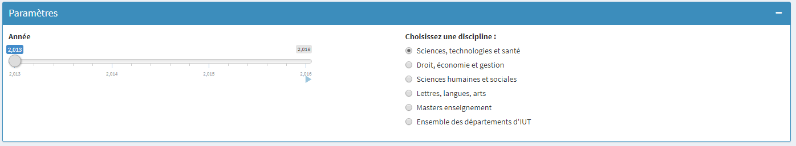

Ce bloc permet de contrôler les différents graphes présents dans le bloc inférieur, en modifiant l'*année* avec un slider et en modifiant la *discipline* avec des radio buttons.

- #### Evolution du taux d'insertion au cours du temps


L'histogramme permet de voir la progression et la distribution des médianes du taux d'insertion (en %) de chaque diplôme au cours des années et en fonction de la discipline choisie. 
L'abscisse représente les types de diplôme et l'ordonnée les médianes du taux d'insertion (en %) de chaque diplôme.

Similairement à l'histogramme, le violin plot montre une représentation abstraite de la distribution empirique du taux d'insertion (en %) de chaque diplôme au cours des années et en fonction de la discipline choisie.
L'abscisse représente les types de diplôme et l'ordonnée le taux d'insertion (en %) de chaque diplôme. 

- #### Evolution des statistiques des emplois au cours du temps 

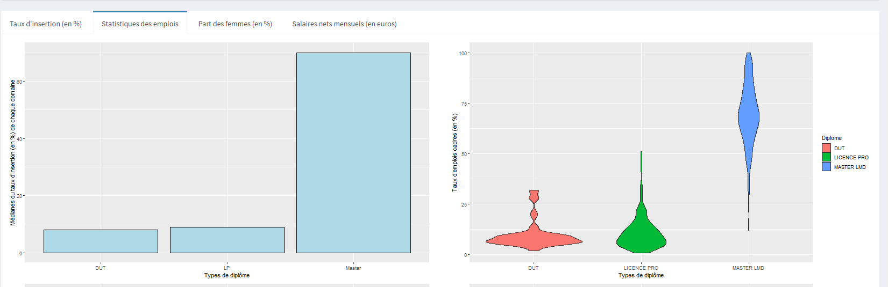

L'histogramme permet de voir la progression et la distribution des médianes du taux d'emplois cadres (en %) de chaque diplôme au cours des années et en fonction de la discipline choisie. 
L'abscisse représente les types de diplôme et l'ordonnée les médianes du taux d'emplois cadres (en %) de chaque diplôme.

Similairement à l'histogramme, le violin plot montre une représentation abstraite de la distribution empirique du taux d'emplois cadres (en %) de chaque diplôme au cours des années et en fonction de la discipline choisie.
L'abscisse représente les types de diplôme et l'ordonnée le taux d'emplois cadres (en %) de chaque diplôme.

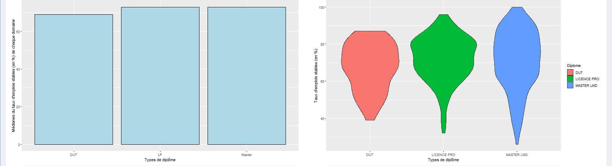

L'histogramme permet de voir la progression et la distribution des médianes du taux d'emplois stables (en %) de chaque diplôme au cours des années et en fonction de la discipline choisie. 
L'abscisse représente les types de diplôme et l'ordonnée les médianes du taux d'emplois stables (en %) de chaque diplôme.

Similairement à l'histogramme, le violin plot montre une représentation abstraite de la distribution empirique du taux d'emplois stables (en %) de chaque diplôme au cours des années et en fonction de la discipline choisie.
L'abscisse représente les types de diplôme et l'ordonnée le taux d'emplois stables (en %) de chaque diplôme.

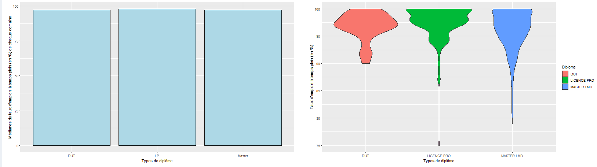

L'histogramme permet de voir la progression et la distribution des médianes du taux d'emplois à temps plein (en %) de chaque diplôme au cours des années et en fonction de la discipline choisie. 
L'abscisse représente les types de diplôme et l'ordonnée les médianes du taux d'emplois à temps plein (en %) de chaque diplôme.

Similairement à l'histogramme, le violin plot montre une représentation abstraite de la distribution empirique du taux d'emplois à temps plein (en %) de chaque diplôme au cours des années et en fonction de la discipline choisie.
L'abscisse représente les types de diplôme et l'ordonnée le taux d'emplois à temps plein (en %) de chaque diplôme.

- #### Evolution de la part des femmes au cours du temps

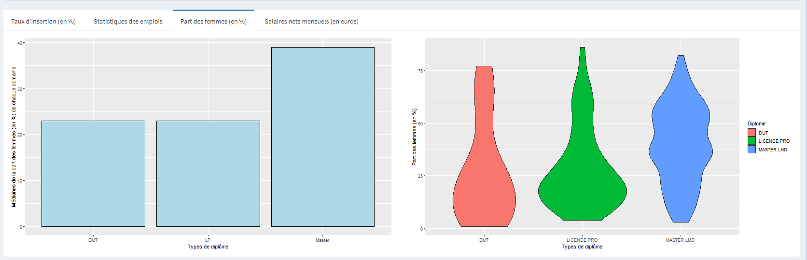

L'histogramme permet de voir la progression et la distribution des médianes de la part des femmes (en %) de chaque diplôme au cours des années et en fonction de la discipline choisie. 
L'abscisse représente les types de diplôme et l'ordonnée les médianes de la part des femmes (en %) de chaque diplôme.

Similairement à l'histogramme, le violin plot montre une représentation abstraite de la distribution empirique de la part des femmes (en %) de chaque diplôme au cours des années et en fonction de la discipline choisie.
L'abscisse représente les types de diplôme et l'ordonnée la part des femmes (en %) de chaque diplôme.

- #### Evolution des salaires nets mensuels au cours du temps


L'histogramme permet de voir la progression et la distribution des médianes des salaires nets mensuels (en euros) de chaque diplôme au cours des années et en fonction de la discipline choisie. 
L'abscisse représente les types de diplôme et l'ordonnée les médianes des salaires nets mensuels (en euros) de chaque diplôme.

Similairement à l'histogramme, le violin plot montre une représentation abstraite de la distribution empirique des salaires nets mensuels (en euros) de chaque diplôme au cours des années et en fonction de la discipline choisie.
L'abscisse représente les types de diplôme et l'ordonnée les salaires nets mensuels (en euros) de chaque diplôme.

### E. *Statistiques par département*

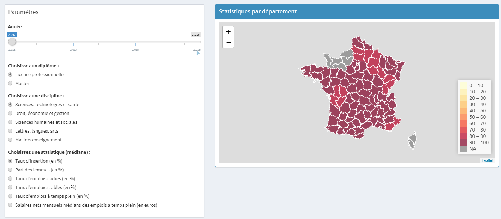

Seuls les jeux de données *[Insertion professionnelle des diplômé.e.s de Licence professionnelle en universités et établissements assimilés](https://www.data.gouv.fr/fr/datasets/insertion-professionnelle-des-diplome-e-s-de-licence-professionnelle-en-universites-et-etablissements-assimiles/#_)* et *[Insertion professionnelle des diplômés de Master en universités et établissements assimilés](https://www.data.gouv.fr/fr/datasets/insertion-professionnelle-des-diplomes-de-master-en-universites-et-etablissements-assimil-0/#_)* sont utilisés sur cette page.

- #### Paramètres

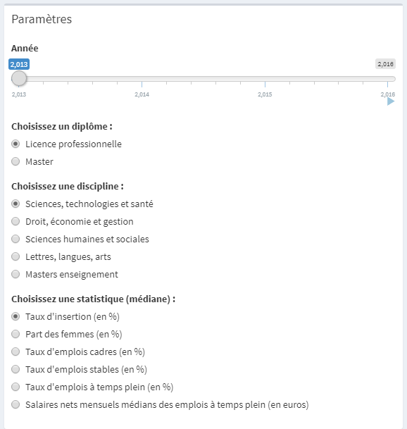

La partie gauche de la page présente les paramètres permettant d'intéragir avec la carte. Le "*slider*" permet de choisir une année ou de faire défiler les années, et les "*radio buttons*" permettent de choisir un diplôme, une discipline et une statistique. 

- #### Partie principale

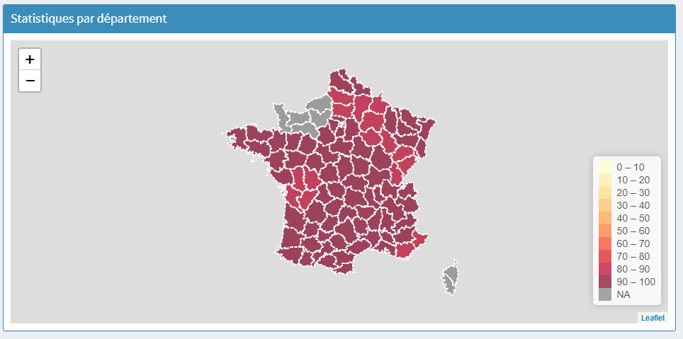

La partie droite de la page affiche une carte des départements de la France métropolitaine. On peut intéragir avec cette dernière grâce aux paramètres, situé à gauche de la carte. Ils permettent de choisir une discipline, un diplôme et une statistique afin d'afficher sur la carte le nom de chaque département avec les valeurs de la statistique choisie en fonction de la discipline et du diplôme choisis. Cela permet d'avoir plus d'informations sur un département spécifique grâce à une représentation géolocalisée des statistiques. De plus, cela permet de comparer un département, une région ou une académie par rapport à d'autres.
Pour pouvoir représenter les statistiques de chaque département sur la carte, nous avons décidé de prendre la médiane des données de chaque département étant donné que la taille des données est conséquente. Nous avons choisi la médiane, plutôt que la moyenne, car celle-ci est plus représentative.

# II. Guide développeur

Dans ce Developper Guide, la structure, le code et le rôle des fichiers dans le projet seront expliqués.

## 1. Les répertoires & fichiers

Dans cette partie, on explique le rôle du répertoire et des fichiers.

### A. *images*

Ce répertoire contient les images servant principalement à la rédaction de ce guide.

### B. *Jeux de données*

Voici l'ensemble des jeux de données utilisés pour le projet :

- ***fr-esr-insertion_professionnelle-dut_donnees_nationales.csv*** : le jeu de données sur les diplômes universitaires de technologie, *[Insertion professionnelle des diplômé.e.s de Diplôme universitaire de technologie (DUT) en universités et établissements assimilés - données nationales par disciplines détaillées](https://www.data.gouv.fr/fr/datasets/insertion-professionnelle-des-diplome-e-s-de-diplome-universitaire-de-technologie-dut-en-universites-et-etablissements-assimiles-donnees-nationales-par-disciplines-detaillees/#_)*.

- ***fr-esr-insertion_professionnelle-lp.csv*** : le jeu de données sur les licences professionnelles, *[Insertion professionnelle des diplômé.e.s de Licence professionnelle en universités et établissements assimilés](https://www.data.gouv.fr/fr/datasets/insertion-professionnelle-des-diplome-e-s-de-licence-professionnelle-en-universites-et-etablissements-assimiles/#_)*.

- ***fr-esr-insertion_professionnelle-master.csv*** : le jeu de données sur les masters, *[Insertion professionnelle des diplômés de Master en universités et établissements assimilés](https://www.data.gouv.fr/fr/datasets/insertion-professionnelle-des-diplomes-de-master-en-universites-et-etablissements-assimil-0/#_)*.

- ***departements.geojson***: Le jeu de données contenant les délimitations des départements de la France métropolitaine ([source](https://france-geojson.gregoiredavid.fr/)). 

### C. *global.R*

Ce fichier contient le code permettant le traitement des données afin que l'on puisse les utiliser et les lire clairement.

### D. *ui.R*

Ce fichier permet de créer l'interface graphique. 

### E. *server.R*

Ce fichier implimente le traitement dynamique des données en créant une interactivité entre les différents composants de l'application et les jeux de données.

### F. *README.md*

Le présent fichier *Markdown* qui contient:
- la présentation du projet avec la problématique,
- le guide de l'utilisateur avec les instructions d'exécution,
- le guide du développeur,
- et le rapport d'analyse.

## 2. Le code

### A. global.R

#### - Le chargement des données

Dans cette section, on récupère les jeux de données nécessaires au fonctionnement de l'application. Par exemple:

```bash
# Lecture du fichier contenant le jeu de données de licence professionnelle 
    diplome.lp <- reactive({
        diplome.lp <- read.csv('fr-esr-insertion_professionnelle-lp.csv', 
                               header = T, 
                               sep = ';', 
                               fill=TRUE, 
                               encoding = "UTF-8")
    })
...
```

Ici on charge le jeux de données *Insertion professionnelle des diplômé.e.s de Licence professionnelle en universités et établissements assimilés*.

### B. ui.R
Le fichier est structuré de la manière suivante:

```bash
# Packages
...

# Création de l'interface de l'application
...
```

#### - Les *packages*

Dans cette section, on charge les packages nécessaires pour le bon fonctionnement de l'application. 

```bash
library(shiny)
library(dplyr)
library(ggplot2)
library(shinydashboard)
library(leaflet)
library(sp)
```

#### - La création de l'interface de l'application

Dans cette section, on crée l'interface de l'application en définissant le contenu du menu et du corps de l'application. 

##### a. Menu

```bash
...
# Contenu du Sidebar
    dashboardSidebar(
        sidebarMenu(
            menuItem("Distribution des échantillons", tabName = "diplome", icon = icon("certificate")),
            menuItem("Statistiques par an", tabName = "ans", icon = icon("chart-line")),
            menuItem("Distribution des disciplines", tabName = "domaine", icon = icon("book")),
            menuItem("Statistiques par département", tabName = "academie", icon = icon("university"))
        ),
        width = 250
    ),
...
```

Ici on crée le menu en créant un label et en donnant une icône.

##### b. Corps de l'application

On crée le corps de l'application en définissant les différents éléments de chaque onglet. Par exemple :

```bash
...
tabItem(tabName = "ans", 
                    box(width = NULL,
                        fluidRow(
                            column(4),
                            column(6,
                                   # Le radioButtons filtre les données alimentant les graphes au-dessous en fonction des disciplines
                                   radioButtons(inputId = "discipline_par_an", 
                                                label = "Choisissez une discipline :", 
                                                list("Sciences, technologies et santé",
                                                     "Droit, économie et gestion",
                                                     "Sciences humaines et sociales",
                                                     "Lettres, langues, arts",
                                                     "Masters enseignement",
                                                     "Ensemble des départements d'IUT")))),
                        title = "Paramètres",
                        solidHeader = TRUE,
                        collapsible = TRUE,
                        status = "primary"),
                    fluidRow(
                        tabBox(id = "tabset_an", width = 12, 
                               # Le taux d'insertion (en %) de chaque diplôme
                               tabPanel("Taux d'insertion (en %)", 
                                        plotOutput(outputId = "Taux_insertion_par_an", height="450px")),
                               # Les statistiques des emplois de chaque dipôme : 
                               # le taux d'emplois cadres, le taux d'emplois stables et le taux d'emplois à temps plein (en %)
                               tabPanel("Statistiques des emplois (en %)", 
                                        plotOutput(outputId = "Taux_emploi_cadre_par_an", height="450px"), 
                                        plotOutput(outputId = "Taux_emploi_stable_par_an", height="450px"), 
                                        plotOutput(outputId = "Taux_emploi_temps_plein_par_an", height="450px")),
                               # Les parts des femmes de chaque diplôme :
                               tabPanel("Part des femmes (en %)", 
                                        plotOutput(outputId = "Part_femmes_par_an", height="450px")),
                               # Les salaires nets mensuels médians des emplois à temps plein (en euros) de chaque diplôme 
                               tabPanel("Salaires nets mensuels (en euros)", 
                                        plotOutput(outputId = "Salaire_par_an", height="450px"))
                        ))),
...
```

Ici, on crée les éléments de l'onglet "Statistiques par an" tels que les "radio buttons" dans le bloc paramètres et les différents onglets pour afficher les graphes.

### C. server.R

Le fichier est structuré de la manière suivante:

```bash
# Packages
...

# Serveur de l'application
...
```

#### - Les *packages*

Dans cette section, on charge les packages nécessaires pour le bon fonctionnement de l'application. 

```bash
library(shiny)
library(dplyr)
library(ggplot2)
library(shinydashboard)
library(leaflet)
library(sp)
```

#### - Le serveur de l'application

Dans cette section, on implimente le traitement dynamique des données en créant une interactivité entre les différents composants de l'application et les jeux de données. Par exemple :

```bash
        ...
        pal <- colorBin("YlOrRd", domain = donnees_carte, bins = bins)
        
        labels <- sprintf(
            string_print,
            academie.dept$nom, donnees_carte
        ) %>% lapply(htmltools::HTML)
        
        m %>% addPolygons(fillColor = ~pal(donnees_carte),
                          weight = 2,
                          opacity = 1,
                          color = "white",
                          dashArray = "3",
                          fillOpacity = 0.7,
                          highlight = highlightOptions(
                              weight = 5,
                              color = "#666",
                              dashArray = "",
                              fillOpacity = 0.7,
                              bringToFront = TRUE),
                          label = labels,
                          labelOptions = labelOptions(
                              style = list("font-weight" = "normal", padding = "3px 8px"),
                              textsize = "15px",
                              direction = "auto"))%>% addLegend(pal = pal, values = ~donnees_carte, opacity = 0.7, title = NULL,position = "bottomright")
    })
```

Ici, on implimente la carte qui va représenter les statistiques par département en fonction de l'année, du diplôme et de la discipline.

# III. Rapport d'analyse

## 1. Les données

On suppose que les données sont traitées.

### A. Insertion professionnelle des diplômé.e.s de Diplôme universitaire de technologie (DUT) en universités et établissements assimilés - données nationales par disciplines détaillées

Ce jeu de données provient de *[data.gouv.fr](https://www.data.gouv.fr/fr/datasets/insertion-professionnelle-des-diplome-e-s-de-diplome-universitaire-de-technologie-dut-en-universites-et-etablissements-assimiles-donnees-nationales-par-disciplines-detaillees/#_)*, plus précisément du ministère de l'enseignement supérieur, de la recherche et de l'innovation.
  
On y retrouve le pourcentage de diplômés occupant un emploi, quel qu'il soit, sur l’ensemble des diplômés présents sur le marché du travail. Il est calculé sur le nombre des diplômés de nationalité française, issus de la formation initiale, entrés immédiatement et durablement sur le marché du travail après l’obtention de leur diplôme en 2013. 
Celui-ci est composé de **732 observations** et de **68 variables**.

<br>

### B. Insertion professionnelle des diplômé.e.s de Licence professionnelle en universités et établissements assimilés

Ce jeu de données provient de *[data.gouv.fr](https://www.data.gouv.fr/fr/datasets/insertion-professionnelle-des-diplome-e-s-de-licence-professionnelle-en-universites-et-etablissements-assimiles/#_)*, plus précisément du ministère de l'enseignement supérieur, de la recherche et de l'innovation.
  
Cette enquête a été menée en décembre 2015, 18 et 30 mois après l’obtention de diplôme, auprès des diplômés de Licence professionnelle de la session 2013. On y retrouve le pourcentage de diplômés occupant un emploi, quel qu'il soit, sur l’ensemble des diplômés présents sur le marché du travail. Il est calculé sur le nombre des diplômés de nationalité française, issus de la formation initiale, entrés immédiatement et durablement sur le marché du travail après l’obtention de leur diplôme en 2013. 
Celui-ci est composé de **6038 observations** et de **32 variables**.

<br>

### C. Insertion professionnelle des diplômés de Master en universités et établissements assimilés

Ce jeu de données provient de *[data.gouv.fr](https://www.data.gouv.fr/fr/datasets/insertion-professionnelle-des-diplomes-de-master-en-universites-et-etablissements-assimil-0/#_)*, plus précisément du ministère de l'enseignement supérieur, de la recherche et de l'innovation.
  
Cette enquête a été menée en décembre 2013, 30 mois après l’obtention de diplôme, auprès de 59 600 diplômés de Master de la session 2011, et en décembre 2012, 30 mois après l’obtention de diplôme, auprès de 47 500 diplômés de Master de la session 2010. 
On y retrouve le pourcentage de diplômés occupant un emploi, quel qu'il soit, sur l’ensemble des diplômés présents sur le marché du travail. Il est calculé sur le nombre des diplômés de nationalité française, issus de la formation initiale, entrés immédiatement et durablement sur le marché du travail après l’obtention de leur diplôme en 2011. 
Celui-ci est composé de **11873 observations** et de **32 variables**.

<br>

## 2. Observations

Dans cette section, nous allons analyser les jeux de données afin de répondre à notre problématique.

### A. Distribution des échantillons 

- #### Histogramme, diagramme à bandes et cartographie

- #### Bilan

### B. Statistiques par an

- #### Analyse temporelle

- #### Bilan

### C. Distributions des disciplines

- #### Histogrammes et violin plots

- **Bilan**

### D. Statistiques par département

- #### Analyse spatiale

- **Bilan**

## 3. Conclusion
